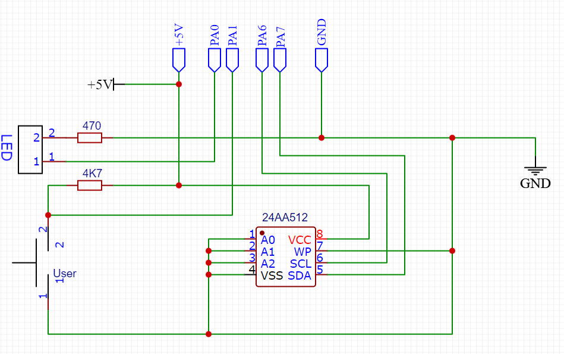
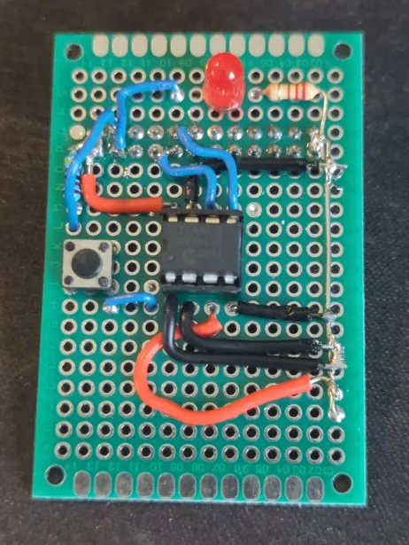
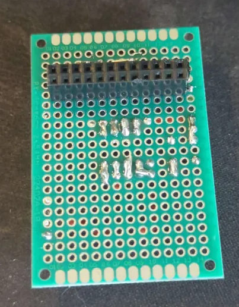
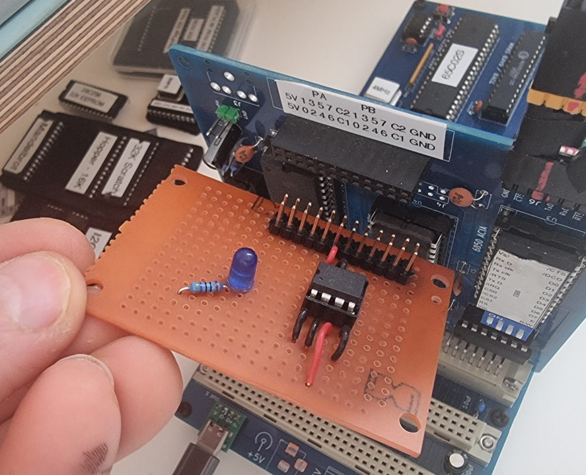

# Hopper 8K BIOS - Getting Started Guide

## Overview

This repository contains prebuilt binaries for 4 different 6502 configurations:

- **Hopper 6502 SBC** - WDC 65C02S (or Rockwell R65C02) at 8MHz
- **Hopper 6502 SBC** - WDC 65C02 (no Rockwell bit instructions) at 8MHz  
- **MECB 6502** - WDC 65C02S (or Rockwell R65C02) at 4MHz
- **MECB 6502** - WDC 65C02 (no Rockwell bit instructions) at 4MHz

**Note:** Only the Hopper 6502 SBC version fits under 8K (due to zero page I/O). The MECB 6502 version requires a 16K ROM.

## Hardware Setup

### EEPROM Installation

- **Hopper 6502 SBC:** Simply plug in the EEPROM
- **MECB 6502:** Requires an I2C EEPROM adapter on the I/O card

### I2C EEPROM Adapter (MECB 6502 Only)

The adapter uses built-in pullups from the Motorola 6821 PIA, eliminating the need for external pullup resistors.

**Addressing Scheme:** A0=Low, A1=Low, A2=Low
- Makes 24AA512 or 24AA256 appear at address 0x50
- A2=High makes 24AA1026 or 24LC1025 appear as 2×64K devices at addresses 0x50 and 0x54

**MECB I/O card I2C adapter Schematic:**


**Dave's version for the 24AA512:**




**My version for the 24LC1025:**


### BIOS Installation

Select the appropriate `BIOS.hex` file for your hardware configuration and burn it to an EEPROM.

## Software Setup

### Terminal Configuration

Use a VT-100 compatible serial terminal (PuTTY recommended).

**Serial Settings:**
- **Baud Rate:** 57,600 (Hopper 6502 SBC) or 76,800 (MECB 6502)
- **Data Bits:** 8
- **Stop Bits:** 1  
- **Parity:** None
- **Flow Control:** XON/XOFF ⚠️ **Important**

**Terminal Settings:**
- Enable "Implicit CR in every LF"
- Use default settings for everything else

## Initial Setup

### First Boot

Upon startup, you should see:

```
HOPPER BIOS
MEMORY: 46334 BYTES AVAILABLE
EEPROM: 64K, 2048 BYTES AVAILABLE
>
```

### Format Storage

**Before doing anything else, format the storage:**

```
> FORMAT
FORMAT WILL ERASE ALL FILES (Y/N)?
```

### Install Core Applications

Use the `HEX` command to install applications by pasting Intel IHex files. The command automatically adds the `.COM` extension and marks files as executable.

**Required Applications:**

1. **EDIT** (Full-screen editor with VT-100 support)
```
> HEX EDIT
READY FOR HEX:
```
*Paste contents of `edit.hex`*

2. **CC** (C compiler)
```
> HEX CC
READY FOR HEX:
```

3. **VASM** (VM OpCode assembler)  
```
> HEX VASM
READY FOR HEX:
```

4. **VM** (OpCode VM)
```
> HEX VM
READY FOR HEX:
```

## Programming Tutorials

### C Programming

#### Essential Tool: CAPTURE

Install the `CAPTURE` utility first - it dramatically speeds up file transfers.

1. **Create the source file:**
```
> EDIT
```
*Copy and paste `CAPTURE.C` source code*
*Save with `^K ^D` and name it `CAPTURE.C`*

2. **Compile the program:**
```
> CC CAPTURE
Memory: 22014
Compiling CAPTURE.C
Saved 1718 bytes
Memory after compile: 14590
Memory after cleanup: 22014
>
```

3. **Use CAPTURE for faster transfers:**
The `CAPTURE` command allows much faster source code transfer than pasting into the editor.

#### Additional C Tools

Compile these useful utilities the same way:
- `TYPE.C` - File display utility
- `HEXDUMP.C` - Hexadecimal file viewer

### VM Assembly Programming

#### Hello World Example

1. **Create the source:**
```
> VASM HELLO
VM Assembler v1.0
Memory: 41470
Memory after compile: 39046
HELLO.BIN Created
Memory after cleanup: 41470
```

2. **Run the program:**
```
> HELLO
Hello, World!
>
```

#### Additional Examples

Try these sample programs:
- `HELLO.VMA` - Basic hello world
- `BLINK.VMA` - LED blink test (if LED hardware is installed)

## Additional Resources

- **C Tools:** `Applets/C/Tools/` directory
- **VM Samples:** `Applets/VM/Samples/` directory
- **Complete source:** https://github.com/sillycowvalley/Hopper/tree/main/Source/Projects/6502SBC/
