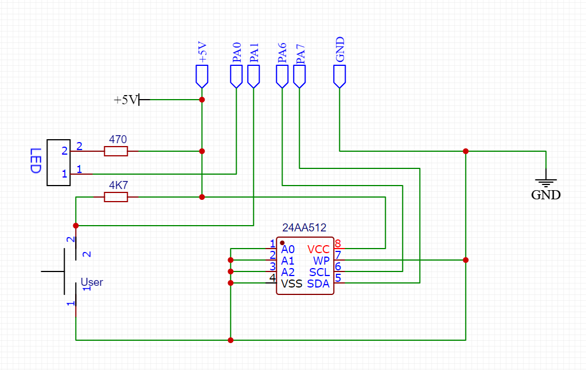

## Getting Started with the 8K BIOS

In these folders there are currently 4 sets of prebuilt binaries:
- Hopper 6502 SBC for WDC 65C02S (or Rockwell R65C02) at 8MHz
- Hopper 6502 SBC for WDC 65C02 (no Rockwell bit instructions) at 8MHz
- MECB 6502 for WDC 65C02S (or Rockwell R65C02) at 4MHz
- MECB 6502 for WDC 65C02 (no Rockwell bit instructions) at 4MHz

Only the Hopper 6502 SBC version is currently under 8K (thanks to the zero page IO).
The MECB 6502 version requires a 16K ROM at the moment.

## EEPROM Support

For the MECB 6502, we need to add a little EEPROM adapter to the I/O card. For the Hopper 6502 SBC, you just plug in the EEPROM.

I didn't bother with pullup resistors since the Motorola 6821 PIA has built-in pullups and they seem to work fine.



This same schematic works for a variety of similar serial I2C EEPROMs. I chose this addressing scheme (A0 low, A1 low and A2 high) since
it will make the 24AA1026 or the 24LC1025 appear as 2x 64K devices at 0x50 and 0x54 respectively.


Pick the appropriate BIOS.hex for your machine and burn it to an EEPROM.

## Terminal

Use your favourite serial terminal that supports VT-100 escape codes (TERM inside the Hopper environment does not). I use PuTTY.

I've been running at 57600 baud on the Hopper 6502 SBC and at 76800 baud on the MECB 6502
8 bits, 1 stop bit, no parity.
**Important:** Make sure Flow Control is set to XON/XOFF.
Under terminal I have "Implicit CR in every LF" checked.

The rest of my settings are defaults.

## Bootstrap

When you first run you should see something like this:

```
HOPPER BIOS
MEMORY: 46334 BYTES AVAILABLE
EEPROM: 64K, 2048 BYTES AVAILABLE
>
```

Before doing anything else, format the storage:

```
> FORMAT
FORMAT WILL ERASE ALL FILES (Y/N)?
```

Now you are ready to upload some tools. The `HEX` command is used to get the first applications on the machine
by copying the Intel IHex files to clipboard and then pasting them in the terminal.

Start with:
```
> HEX EDIT
READY FOR HEX:
```

And past the context of the `edit.hex` file from the subfolder under the version of the BIOS you have installed.
The `HEX` command will automatically add the `.COM` extension and mark the file as executable.

`EDIT` is a full screen editor that takes advantage of your VT-100 compatible terminal.

Also install the C compiler, `CC`,
the VM OpCode assembler, `VASM`,
and the OpCode VM, `VM` the same way.


## First C Program

Under than Applets/C folder are several tools, one of which is currently indispensible:
https://github.com/sillycowvalley/Hopper/tree/main/Source/Projects/6502SBC/Applets/C/Tools

Type `EDIT` to launch the editor.

Copy the source `CAPTURE.C` to your clipboard and paste into the editor.
`^K ^D` to save it and give it the name `CAPTURE.C`.

Use the C compiler to compile the tool:

```
> CC CAPTURE
Memory: 22014
Compiling CAPTURE.C
Saved 1718 bytes
Memory after compile: 14590
Memory after cleanup: 22014

>
```

You can now use the `CAPTURE` command to transfer other source to your computer much faster than pasting into the editor.

Try doing this with `TYPE.C` and `HEXDUMP.C` and compiling them. They do what you think they should.

## First .VMA Program

To experiment with .VMA programs, that a look in the samples folder:

https://github.com/sillycowvalley/Hopper/tree/main/Source/Projects/6502SBC/Applets/VM/Samples

Try `HELLO.VMA` or `BLINL.VMA` if you have an LED installed. To compile a .VMA:

```

> VASM HELLO
VM Assembler v1.0
Memory: 41470
Memory after compile: 39046
HELLO.BIN Created
Memory after cleanup: 41470

> HELLO
Hello, World!

>
```

